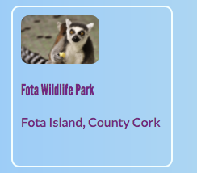

1. Here's a technique you could use to make a photo gallery, or a portfolio page showing off all of your projects: little **preview cards**. Add the following HTML code to your web page:
   ```html
        <article class="card">
            
            <h4>Fota Wildlife Park</h4>
            <p>Fota Island, County Cork</p>
		</article>
   ```
  I'm going to do a bunch of cards with some highlights of the tourist attractions in Ireland. You can change the pictures and text to whatever you like!
    
2. Add the following CSS code for the classes _card_ and _smallPics_ as well as for the heading _h3_:
   ```css
        h3 {
            font-family: "League Gothic", sans-serif;
            font-style: normal;
            font-weight: 400;
        }
        .smallPics {
            height: 60px;
            border-radius: 10px;
        }
        .card {
            width: 200px;
            height: 200px;
            border: 2px solid #F0FFFF;
            border-radius: 10px;
            box-sizing: border-box;
            margin-top: 10px;
            font-family: "Lato", sans-serif;
        }
        .card:hover {
            border-color: #1E90FF;
        }
   ```
   The font-families **League Gothic** and **Lato** are used a lot in CoderDojo materials!

3. You should have something that looks like this now: Let's turn the whole thing into a link so people can click to see more information. 

4. Place the whole **article** element inside a link element. Make sure the closing `</a>` tag is after the closing `</article>` tag! 
    ```html
        <a href="attractions.html#scFota">  
            <article class="card ">
                
                <h3>Fota Wildlife Park</h3>
                <p>Fota Island, County Cork</p>
            </article>
        </a>
    ```
    
5. Notice how the value of **href** in my link ends in _#scFota_? This is a neat trick you can use to jump to a particular part of a page. First you type the URL of the page to link to, followed by **#**. In the code file for the page you are linking to, find the part you want to jump to and give that element an **id**, for example, `<section id="scFota"`. The value of the **id** is what you type after the **#** in your link.

6. Now all the text has gone funny because it's a link. You can fix it by adding a **CSS class** to the link, `class="cardLink"`.
   ```css
        .cardLink {
            color: inherit;
            text-decoration: none;
        }
   ```
   Setting the value of any property to _inherit_ makes it use the value that the **parent** element has, so in this case the text colour will match the rest of the text on the homepage.

7. Make at least four or five of these cards. On the next Sushi Card you'll arrange them with a cool trick!