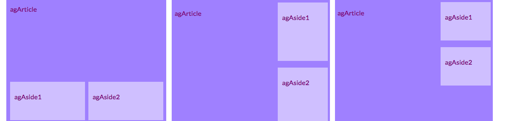

1. For this card you should work with a page that contains a **main** element with three elements inside, one **article** and two **aside**. Go ahead and create these first if you need to. If you want to work with my website, add the **aside** code from the previous Sushi Card onto the Attractions page. Here are three different page layouts you'll be applying: 

2. Add new CSS classes to **main** and each of three elements inside it.
   ```html
        <main class="attPageLayoutGrid">
            <article class="attGridArticle">
                <!--other stuff here-->
            </article>
            <aside class="attGridAside1">
                <!--other stuff here-->
            </aside>
            <aside class="attGridAside1">
                <!--other stuff here-->
            </aside>
        </main>
   ```
   The container you'll change the layout of is **main**, but you could do this with any kind of container, like a **div** or **article**, or even the whole page **body**. The technique you're going to use is called **CSS grid**.

3. Set the **display** property to _grid_ on the overall container:
   ```css
        .attPageLayoutGrid {
            display: grid;
            grid-column-gap: 0.5em;
            grid-row-gap: 1em;
        }
   ```
    What do you think the **grid-column-gap** and **grid-row-gap** properties do?

4. Next, you name a **grid-area** for each element: 
   ```css
        .attGridArticle {
            grid-area: agArticle;
        }
        .attGridAside1 {
            grid-area: agAside1;
        }
        .attGridAside2 {
            grid-area: agAside2;
        }
   ```
5. Then you design your layout! Let's put the two **aside** elements side by side at the bottom. For this you need two **columns** of equal width. You can keep the **row** height automatic. Put the following code inside the _.attPageLayoutGrid_ CSS rules:
   ```css
        grid-template-rows: auto;
        grid-template-columns: 1fr 1fr;
        grid-template-areas: 
            "agArticle agArticle"
            "agAside1 agAside2";
   ```
    _fr_ stands for _fraction_. Notice how you make the **article** take up all the space over the two columns.

6. Let's try putting the **aside** elements over on the right, and making them half the width of the **article**. Change the values of **grid-template-columns** and **grid-template-areas** to:
   ```css
        grid-template-columns: 2fr 1fr;
        grid-template-areas: 
            "agArticle agAside1"
            "agArticle agAside2";
   ```
   If you don't want the **aside** elements to stretch all the way to the bottom, you can add a blank space using a dot: 
   ```css
        grid-template-areas: 
            "agArticle agAside1"
            "agArticle agAside2"
            "agArticle . ";
   ```

7. With **CSS grid** you can make almost any layout you like. In this example the **header** and **footer** were left out of the design, but they could be included in the grid too. If you want to learn more about **CSS grid**, go to [dojo.soy/html3-css-grid](http://dojo.soy/html3-css-grid)
