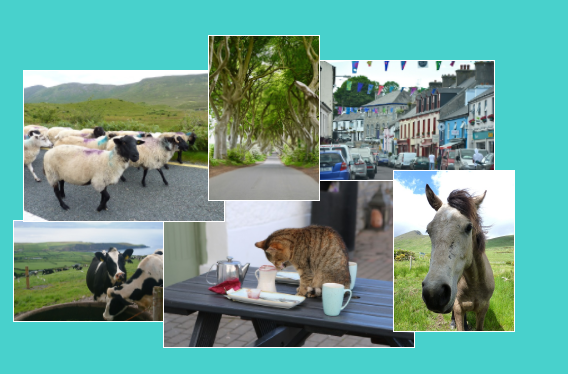

1. Add a `div` to your page and put a couple of images in it. Give the `div` and the `img` elements `id` values.
    ```html
      <div id="photoBox">
        
        
      </div>
    ```
    You will use CSS to position the photos exactly and make a photo collage.
2. In your CSS file, add separate style rules for each of the elements using **id selectors**.
    ```css
        #photoBox {
            width: 800px;
            height: 400px;
        }
        #imgHorse {
            width: 120px;
        }
        #imgTeaCat {
            width: 250px;
        }
    ```

3. The photos appear one after the other in the order they appear in your code. To choose exact positions, you do two things. First, add the property `position: absolute;` to each photo's CSS rules. Second, add the property `position: relative;` to the CSS rules for the container they are in. This makes it be the **parent** of the images so the positions are in relation to it.

4. Then, you choose exact positions for each picture. There are four properties you can use: `left`, `right`, `top`, and `bottom`. They represent how far each of the edges should be from the parent's edge. Use either `top` or `bottom` for the vertical position and use either `left` or `right` for the horizontal position.

5. This code places the cat picture _100 pixels_ from the top and _60 pixels_ in from the left.
    ```css
        #imgTeaCat {
            width: 250px;
            top: 100px;
            left: 60px;
            position: absolute;
        }
    ```
    * The position values can also be negative!

6. You can also decide how the pictures overlap, using the `z-index` property. The value can be any whole number. The picture with the highest number ends up on top of the pile!
    ```css
        #imgHorse {
            width: 120px;
            top: 20px;
            left: 10px;
            position: absolute;
            z-index: 10;
        }
        #imgTeaCat {
            width: 250px;
            top: 100px;
            left: 60px;
            position: absolute;
            z-index: 7;
        }
    ```
7. Add a bunch more photos and use exact positioning together with different `z-index` values to make a nice collage! 
